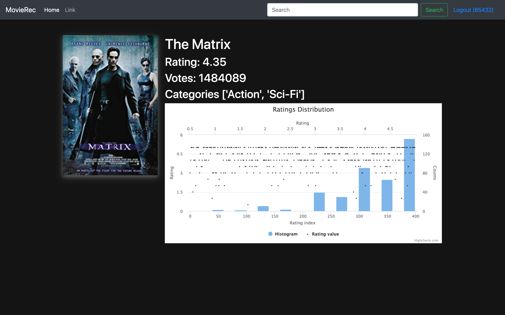
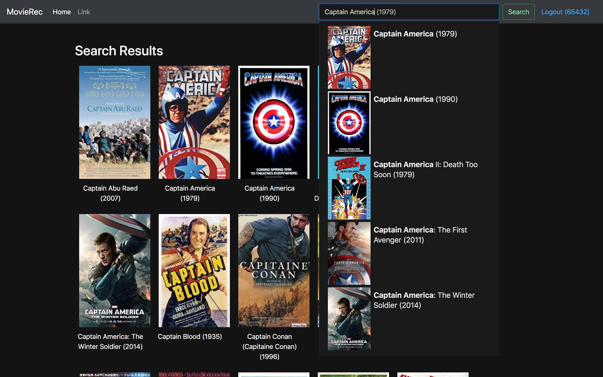

Name;Nigar Alizada and Elifcan Yasar
Subject;Cloud-oriented web applications L1
This is movie recommendation system.we created Machine Learning model and use Python Flask them deploy with Docker


## Requirements
1. Docker
2. Docker Compose

## Instructions to start the server.
1. Clone this repository by executing the following command in your terminal:
```>> git clone https://github.com/amitasviper/recommendation-system```
2. Goto into this directory using the following command:
```>> cd recommendation-system```
3. execute the following command
```>> docker-compose up```

## Opening the UI
1. To open the Web UI of the application, open your favorite browser and hit the URL `http://localhost/`

<p align="center">
  
</p>

<p align="center">
  
</p>

<p align="center">
  
</p>
